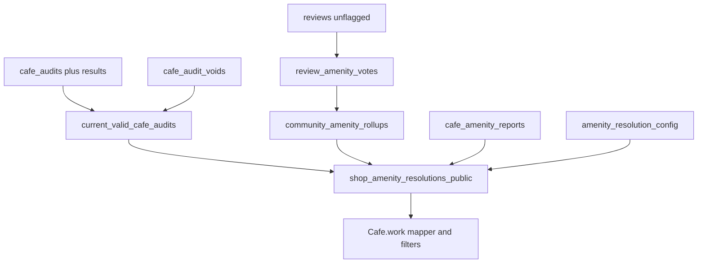

# Amenity Source of Truth

Pilot design for trustworthy WiFi and outlet status in Marikina. Team on-site audits and community reviews feed one resolved status per amenity. This document is the implementation plan only: do not apply the SQL here, and do not treat it as live schema.

**In scope:** data model, resolution logic, seed backfill as `reported`, filter and query behavior, café card and detail labels, a sub-3-minute mobile audit form in the admin portal, void/correct tooling, audit trail, tests, rollout.

**Out of scope:** owner subscriptions, billing, push notifications, personalization, review weighting, new gamification.

**Hard rule:** never display availability that is not backed by a valid audit or by reviews. Unknown stays unknown.

---

## a) Current-state summary

WiFi and outlets are **not stored on `shops`**. They are voted on `reviews`, rolled up in the `shop_review_stats` view, then confirmed on the client. Edge Functions do not derive amenities. Types are hand-written; there is no generated `Database` type file.

### Write path

| Step | Path |
|---|---|
| Review form draft | [`app/pages/app/cafes/[id]/review.vue`](../../app/pages/app/cafes/[id]/review.vue) |
| Normalize + insert shape | [`app/utils/cafe-review.ts`](../../app/utils/cafe-review.ts) (`normalizeDraft`, `draftToReviewInsert`) |
| Upsert one review per `(shop_id, user_id)` | [`app/composables/useCafeReview.ts`](../../app/composables/useCafeReview.ts) |
| CHECKs, dependents, `reviews_before_write` | [`db/20260909_cafe_reviews.sql`](../../db/20260909_cafe_reviews.sql) |

`reviews` columns used for work amenities: `wifi_available`, `wifi_speed`, `wifi_time_limit`, `power_available`, `power_access`, plus `stay_fit` (long/short/unsure). Tri-state votes are `'yes' | 'no' | 'unsure'`. Speed and power-access dependents are required only when the amenity is `'yes'` (CHECKs around lines 228–276; trigger 278–322). Flagged reviews are excluded from public read and from `shop_review_stats`.

Comment on the table (line 219–220):

> Amenities are voted here, not stored on shops.

### SQL aggregate (list/map source today)

[`db/20260909_cafe_reviews.sql`](../../db/20260909_cafe_reviews.sql) lines 417–453, view `shop_review_stats` (`security_invoker = true`):

- `wifi_available_pct` / `power_available_pct` = `round(100 * yes / (yes+no))`. **`unsure` is excluded from the denominator.** `NULL` if nobody decided.
- `wifi_yes_count` / `power_yes_count` count `'yes'` only.
- `wifi_speed_mode`, `wifi_time_limit_mode`, `power_access_mode` use `mode() WITHIN GROUP`.
- `total_reviews` counts **all** unflagged reviews on approved shops, including unsure.

Public review cards: same file, `shop_reviews_public` (370–398).

### Client confirmation (Home, Search, Map, cards, filters)

| Piece | Path | Behavior |
|---|---|---|
| Fetch shops + stats | [`app/utils/approved-shops.ts`](../../app/utils/approved-shops.ts) 60–112, 155–187 | `shops` (`status = approved`, optional bbox/`ilike`) then `shop_review_stats` and `shop_marker_tiers` by id |
| Catalog composable | [`app/composables/useApprovedShops.ts`](../../app/composables/useApprovedShops.ts) | Loads **all** approved shops; no amenity filter in SQL |
| Map viewport | [`app/composables/useMapCafes.ts`](../../app/composables/useMapCafes.ts) | Padded bbox, 8 km cap, 280 ms debounce, fetch limit 80 |
| Work facts | [`app/utils/shop-mapper.ts`](../../app/utils/shop-mapper.ts) 22–67, 103–115 | `REVIEW_THRESHOLD = 3`, `AMENITY_YES_PCT = 50` |
| Types | [`app/types/shop.ts`](../../app/types/shop.ts) 65–73, [`app/types/cafe.ts`](../../app/types/cafe.ts) 2–16, 24–51 | `CafeWorkFacts.known` + boolean/`null` fields; `amenities: Amenity[] \| 'none'` |

```text
if total_reviews < 3 → UNKNOWN_WORK (known: false, all nulls), amenities: []
wifi  = (wifi_available_pct  ?? 0) >= 50
plug  = (power_available_pct ?? 0) >= 50
longStay = wifi AND wifi_time_limit_mode === 'unlimited'
```

`stay_fit_mode` is unused for work facts. SQL `mode()` tie-breaks by sort order; client `modeOf` in [`app/utils/cafe-review.ts`](../../app/utils/cafe-review.ts) uses first-seen. They can diverge.

### Detail insights (different bar)

[`app/utils/cafe-review.ts`](../../app/utils/cafe-review.ts) `INSIGHT_MIN_REVIEWS = 1` (line 19), `wifiInsightFromStats` / `plugInsightFromStats` (302–339). **Any `yes_count > 0` → “available”**, even as a minority. [`hydrateCafeDetail`](../../app/utils/approved-shops.ts) (262–279) can fill missing insights from up to 20 public rows via `statsFromPublicReviews`. It does **not** recompute `work` / `amenities`. Result: a café can show insight copy while the card still says “Not confirmed”.

### Filters, feed, map

Filters are **client-side**, not a Supabase query.

[`app/utils/cafe-filters.ts`](../../app/utils/cafe-filters.ts) 3–40:

| Filter id | Chip | Match |
|---|---|---|
| `wifi` | WiFi | `cafe.work.wifi === true` |
| `plugs` | Plugs | `cafe.work.plug === true` |
| `long-stay` | Long-stay WiFi | `cafe.work.longStay === true` |
| `fast-wifi` | Fast WiFi | `cafe.work.wifiSpeed === 'fast'` |
| `reliable-outlets` | Reliable outlets | `cafe.work.outletReliability === 'easy'` |

Unconfirmed work (`known: false`) does not match. Home ([`app/pages/app/index.vue`](../../app/pages/app/index.vue)) and Search ([`app/pages/app/search.vue`](../../app/pages/app/search.vue)) run `filterCafes` then a 12-item infinite window ([`app/utils/infinite-list.ts`](../../app/utils/infinite-list.ts), [`app/composables/useInfiniteWindow.ts`](../../app/composables/useInfiniteWindow.ts)). Map does not use these chips; suggestion icons appear when `work.known && work.wifi/plug` ([`app/pages/app/map.vue`](../../app/pages/app/map.vue)).

### Card and detail copy

[`app/components/cafe/CafeCard.vue`](../../app/components/cafe/CafeCard.vue) 93–110:

- unknown → `Not confirmed`
- `wifi === true` → `Confirmed`; else `No WiFi`
- same pattern for outlets (`Confirmed` / `No outlets`)

[`app/components/cafe/CafeDetailContent.vue`](../../app/components/cafe/CafeDetailContent.vue): gap copy via `amenityGapCopy` (`WiFi and outlets not confirmed yet` / `No WiFi or power outlets`); chips from `amenities`; insight sections from `wifiInsight` / `plugInsight`.

### Admin, roles, RLS, photos, analytics

| Concern | Path |
|---|---|
| Nav | [`app/utils/admin-nav.ts`](../../app/utils/admin-nav.ts) — dashboard, cafes, requests, claims, partnerships, ads, users, moderation. No audits section. |
| Shell | [`app/components/admin/AdminShell.vue`](../../app/components/admin/AdminShell.vue) |
| Data | [`app/composables/useAdminPortal.ts`](../../app/composables/useAdminPortal.ts) |
| Gate | [`app/middleware/admin.ts`](../../app/middleware/admin.ts) — `profiles.role !== 'admin'` → `/app`. **Auditors cannot enter `/admin` today.** |
| Roles | `profiles.role` enum `user \| cafe-owner \| admin`. JWT is session only. `is_admin()` in [`db/20260928_favorites_profiles_moderation.sql`](../../db/20260928_favorites_profiles_moderation.sql) 37–50. Latest role RPC: [`db/20260930_sync_cafe_owner_role_enum_assign.sql`](../../db/20260930_sync_cafe_owner_role_enum_assign.sql) 42–76 (`'user' \| 'cafe-owner' \| 'admin'`). |
| Audit log | [`db/20260929_admin_portal.sql`](../../db/20260929_admin_portal.sql) `admin_audit_log` + `admin_write_audit`. Append-only in practice (no UPDATE/DELETE policy). No admin UI for the log. |
| Privileged writes | Security-definer RPCs; session GUC `app.admin_shop_write` for shop triggers. |
| Photos | [`db/functions/presign-upload/index.ts`](../../db/functions/presign-upload/index.ts) — purposes `shop-logo` / `ad-banner`. Vue uses multipart proxy (`uploadAdminAsset`). JSON `{ uploadUrl, objectKey, publicUrl }` path exists and is unused. Store object keys, never client URLs. |
| SQL tests | Manual: [`db/verify/admin_portal_rls.sql`](../../db/verify/admin_portal_rls.sql). Automated: Bun unit tests of TS that mirrors SQL (`bun test`). No pgTAP. |
| Product analytics | **None.** No PostHog/Plausible/`product_events` table. |

Append-only precedent: `shop_busyness_reports` (insert-only + cooldown). Correction-in-place precedent: reviews upsert. End-don’t-delete: placements `ends_at`, ads `cancelled_at`, reviews `flagged_at`.

### Conflicts with the stated “current behavior”

The brief said: show WiFi/outlets only when **at least 3 reviews address that amenity** and a **majority agree**; otherwise unknown.

Verified code does this instead:

| Surface | Min reviews | Yes rule | 50/50 tie | All unsure after 3 reviews |
|---|---|---|---|---|
| Cards / filters / `work` | 3 **total** reviews (including unsure) | `pct >= 50` of decided votes | **Yes** | `pct` is `NULL` → treated as 0 → **No WiFi / no outlets** |
| Detail insights | 1 | Any yes vote | Available | Unreliable / scarce |

The new model **must not preserve** those bugs. Thresholds count **decided** amenity votes. Ties are `mixed`, never availability. Unsure never becomes a known negative.

---

## b) Data model

Small additive migrations. Keep `reviews` and `shop_review_stats` during rollout (rating, popular, matcha, and the feature-flag fallback still need them). No destructive changes to review rows.

Suggested filenames (apply later, in order, as separate SQL-editor queries where enum labels are added):

1. `db/20261002_user_role_auditor.sql` — enum label only
2. `db/20261002_amenity_source_of_truth.sql` — tables, RPCs, RLS, grants
3. `db/20261002_amenity_resolutions.sql` — views (can ship in PR 2)

### Role

Standalone enum add, same convention as [`db/20260930_user_role_cafe_owner.sql`](../../db/20260930_user_role_cafe_owner.sql):

```sql
alter type public.user_role add value if not exists 'auditor';
```

PostgreSQL cannot use a new enum label in the same transaction that adds it. `admin_set_profile_role` (latest body in `20260930_sync_cafe_owner_role_enum_assign.sql`) must then accept `'auditor'`. `sync_cafe_owner_role` must **skip `auditor` the same way it skips `admin`**, so a verified claim cannot silently demote an auditor.

Pilot limitation: `profiles.role` is a single value. One person cannot be `cafe-owner` and `auditor` at once. Accept this for the pilot. A capability table (`audit_staff`) is over-engineering unless combined roles become a real requirement.

Helpers:

```sql
create or replace function public.is_auditor()
returns boolean
language sql stable security definer
set search_path = public
as $$
  select exists (
    select 1 from public.profiles
    where id = auth.uid() and role::text in ('admin', 'auditor')
  );
$$;
```

Keep `is_admin()` unchanged (admins only). Auditors never pass existing admin RPCs.

### Config table — `amenity_resolution_config`

Keyed by extensible text `amenity_key`. Seed rows: `wifi`, `outlets`, `long_stay_wifi`. Public clients do not read this table; only the resolver views and admin RPCs do.

| Column | Type | Default | Notes |
|---|---|---|---|
| `amenity_key` | `text` PK | | `'wifi'`, `'outlets'`, `'long_stay_wifi'` |
| `enabled` | `boolean` | `true` | Disabled keys resolve to unknown |
| `community_min_decided` | `int` | `3` | Decided votes required for `community_confirmed` |
| `community_majority_ratio` | `numeric` | `0.5` | Share must be **strictly greater** than this (`>` not `>=`) |
| `contradiction_min_decided` | `int` | `3` | Recent opposite votes to flag `needs_recheck` |
| `contradiction_window_days` | `int` | `90` | “Recent” window |
| `stale_after_days` | `int` | `180` | Team-verified stale threshold |
| `fast_download_mbps` | `numeric` | `25` | Optional; Fast WiFi filter when the winning source is an audit |
| `updated_at` | `timestamptz` | `now()` | |
| `updated_by` | `uuid` | | Admin who last changed config |

Admin-only writes via RPC (or direct UPDATE under `is_admin()` RLS). Do not scatter these numbers in TS.

Integer votes with ratio `0.5` and a strict `>` comparison are equivalent to `yes_count > no_count`. Document that in the SQL comment so nobody “fixes” it back to `>=`.

### Audits — append-only `cafe_audits`

One row per visit. Corrections insert a **new complete row** with `corrects_audit_id`. No UPDATE/DELETE on this table.

| Column | Type | Notes |
|---|---|---|
| `id` | `uuid` PK | `gen_random_uuid()` |
| `shop_id` | `uuid` FK `shops(id)` | Must be `approved` at write time |
| `auditor_id` | `uuid` not null | `auth.uid()` at insert |
| `audited_at` | `timestamptz` not null | Visit time; defaults to `now()` |
| `timezone` | `text` not null | Default `'Asia/Manila'` |
| `time_of_day_local` | `time` | When WiFi was tested |
| `seating_capacity_estimate` | `int` | Nullable; `>= 0` if present |
| `long_stay_stance` | `text` not null | `'welcome' \| 'discouraged' \| 'unknown'` |
| `staff_confirmed_long_stay` | `boolean` not null | Whether staff were asked |
| `notes` | `text` | Staff-only; length cap ~2000 |
| `corrects_audit_id` | `uuid` FK `cafe_audits(id)` | Null on first visit |
| `client_idempotency_key` | `uuid` not null unique | Prevents double-submit on retry |
| `created_at` | `timestamptz` not null | Insert time; never changed |

Checks: `corrects_audit_id` must point at a non-voided audit for the **same shop**. Indexes: `(shop_id, audited_at desc, created_at desc)`, unique `client_idempotency_key`.

### Amenity results — `cafe_audit_amenity_results`

| Column | Type | Notes |
|---|---|---|
| `audit_id` | `uuid` FK | Cascade with parent only if we never delete; prefer RESTRICT |
| `amenity_key` | `text` | FK-like check against config keys |
| `result` | `text` not null | `'available' \| 'unavailable' \| 'unknown'` |
| `wifi_download_mbps` | `numeric` | WiFi only; `>= 0` |
| `wifi_upload_mbps` | `numeric` | WiFi only |
| `wifi_network_name` | `text` | SSID; **staff-only, never public** |
| `wifi_password_required` | `boolean` | WiFi only |
| `outlet_approx_count` | `int` | Outlets only |
| `outlet_reliability` | `text` | `'easy' \| 'limited' \| 'scarce'`; outlets only |
| `seating_near_outlet_notes` | `text` | Outlets; staff-only |
| `reliability_notes` | `text` | Staff-only |
| `amenity_notes` | `text` | Staff-only |
| PK | `(audit_id, amenity_key)` | |

`submit_cafe_audit` always writes `wifi` and `outlets` rows. It also writes `long_stay_wifi`:

- `available` iff wifi result is `available` **and** `long_stay_stance = 'welcome'`
- `unavailable` iff wifi is `unavailable`, **or** wifi is `available` and stance is `'discouraged'`
- `unknown` otherwise (wifi unknown, or stance unknown)

Do not infer long-stay from WiFi alone. Structured outlet reliability is required when outlets are `available` (filters cannot parse free text).

### Photos — `cafe_audit_photos`

| Column | Type | Notes |
|---|---|---|
| `id` | `uuid` PK | |
| `audit_id` | `uuid` | |
| `object_key` | `text` not null | R2 key; format check like `shops.logo_object_key` |
| `content_type` | `text` | jpg/png/webp |
| `byte_size` | `int` | |
| `caption` | `text` | Optional, short |
| `created_by` | `uuid` | |
| `created_at` | `timestamptz` | |

Store keys, never client URLs. Public listing photos stay on `shops`; audit photos are evidence for staff, not café gallery images, unless an admin later copies a key into the listing (out of scope).

### Voids — `cafe_audit_voids`

One row per voided audit. PK `audit_id`. Columns: `actor_id`, `reason` (required, min length), `created_at`. Admin-only insert via RPC. Voiding the latest valid audit makes the resolver fall back to the next latest non-voided audit for that shop. No audit UPDATE/DELETE.

### Seed / import signals — `cafe_amenity_reports`

Append-only founder/import evidence. **Not synthetic reviews.** Never increments community vote counts.

| Column | Type | Notes |
|---|---|---|
| `id` | `uuid` PK | |
| `shop_id` | `uuid` | |
| `amenity_key` | `text` | |
| `result` | `text` | `'available' \| 'unavailable'` only — do not import blanks |
| `observed_at` | `timestamptz` | List date or import date |
| `source` | `text` | `'founder_seed'` initially |
| `import_batch_id` | `uuid` | |
| `source_row_key` | `text` | Stable id from the source file |
| `notes` | `text` | |
| `created_by` | `uuid` | Admin importer |
| `created_at` | `timestamptz` | |

Unique `(source, source_row_key)` (or `(import_batch_id, source_row_key)` plus a global source-row unique) so re-running a batch is a no-op. Index `(shop_id, amenity_key, observed_at desc)`.

Mirror voids with `cafe_amenity_report_voids` (`report_id` PK, `actor_id`, `reason`, `created_at`) so a bad seed batch can be withdrawn without DELETE. Rollback uses this, not a down migration.

### Views (resolver; PR 2)

1. **`review_amenity_votes`** — one row per unflagged review × amenity on approved shops.

   | Amenity | Yes | No | Unsure |
   |---|---|---|---|
   | `wifi` | `wifi_available = 'yes'` | `= 'no'` | `= 'unsure'` |
   | `outlets` | `power_available = 'yes'` | `= 'no'` | `= 'unsure'` |
   | `long_stay_wifi` | wifi yes **and** `wifi_time_limit = 'unlimited'` **and** `stay_fit = 'long'` | wifi no, **or** wifi yes and (`wifi_time_limit in ('voucher','purchase')` **or** `stay_fit = 'short'`) | everything else (wifi unsure, unlimited+stay unsure, time-limit unsure) |

   Columns: `shop_id`, `review_id`, `amenity_key`, `vote` (`yes\|no\|unsure`), `vote_weight numeric default 1.0`, `voted_at` (`reviews.updated_at`). The weight column is the **future weighting seam**. Do not vary it now. Use `updated_at` because reviews are upserted.

2. **`current_valid_cafe_audits`** — per `shop_id`, the latest `cafe_audits` row with no matching `cafe_audit_voids`, ordered by `audited_at desc, created_at desc`.

3. **`community_amenity_rollups`** — per `(shop_id, amenity_key)`: `decided_count`, `yes_count`, `no_count`, `last_voted_at`, summing `vote_weight` on decided votes only.

4. **`shop_amenity_resolutions`** — internal/full resolver (may include auditor id for admin). **Public contract:** `shop_amenity_resolutions_public` with `security_invoker = false` (same pattern as `shop_reviews_public`) so it can read audits without exposing them.

Public columns (no auditor UUID, SSID, notes, photo keys):

| Column | Meaning |
|---|---|
| `shop_id` | |
| `amenity_key` | |
| `availability` | `available \| unavailable \| mixed \| unknown` |
| `confidence` | `team_verified \| community_confirmed \| reported \| unknown` |
| `source_at` | Audit `audited_at`, max contributing review `updated_at`, or seed `observed_at` |
| `decided_count`, `yes_count`, `no_count` | Community evidence (0 when the winner is an audit-only shop) |
| `is_stale` | Team-verified and `source_at` older than config stale interval |
| `needs_recheck` | Team-verified contradicted by recent reviews |
| `wifi_speed` | Safe categorical from winning source (`slow\|okay\|fast`) or null |
| `wifi_time_limit` | Safe categorical or null |
| `outlet_reliability` | `easy\|limited\|scarce` or null |
| `download_mbps_band` | Optional coarse band for Fast WiFi; **not** the raw measurement if that feels too precise — prefer categorical `wifi_speed` derived at write/resolve time |

Raw Mbps, SSID, seating notes, and photos stay on staff tables.

### Indexes

- `cafe_audits (shop_id, audited_at desc, created_at desc)`
- `cafe_audit_amenity_results (audit_id, amenity_key)` unique already
- `cafe_amenity_reports (shop_id, amenity_key, observed_at desc)`
- `reviews (shop_id, updated_at desc) where flagged_at is null` (partial; `reviews_shop_created_idx` exists on `created_at`)
- Unique `cafe_audits.client_idempotency_key`
- Unique seed `(source, source_row_key)`
- Unique one-void-per-audit / per-report

Queue pages filter the public/admin resolution view in the client for the pilot (`needs_recheck` first, then stale oldest-first). Do not add extra partial indexes until a queue query is slow.

### Over-engineering to skip

- Materialized views
- Generic rules engine / JSON logic DSL
- Per-user vote weights
- Fuzzy café matching on import
- A second “current status” table that must be trigger-maintained (derive from latest valid audit + views)
- Making audit photos the public café gallery

---

## c) Resolution logic

### Where it lives

**Recommend: Postgres views (plus a tiny SQL function if the CASE tree is clearer as `resolve_shop_amenity(...)`).**

| Option | Filter / infinite-scroll | Consistency | Sensitivity | Verdict |
|---|---|---|---|---|
| **Postgres view** | Same answer for cards, detail, map, admin queues. Pilot keeps today’s shops + `.in(shop_ids)` fetch; later a `list_approved_cafes` RPC can filter on view columns without changing semantics. | One implementation | Public view strips SSID/notes | **Choose** |
| Edge Function | Extra hop on every feed/map fetch; duplicates query composition | Easy to drift from SQL | Can hide rows, but slower | Reject for this |
| Client TS | Recreates today’s split rules; cannot drive SQL filters later | High drift risk | Would need raw audits on the client | Reject as SoT. Keep a **pure TS mirror** of the rules for unit tests only, documented as a mirror not a second SoT. |

Marikina / early catalog: keep [`fetchApprovedCafes`](../../app/utils/approved-shops.ts) shape. Replace amenity mapping from `shop_review_stats` with a parallel `shop_amenity_resolutions_public` fetch by shop id. Map bbox stays capped at 80. Upgrade trigger for a cursor RPC: catalog much larger than the current all-approved Home load, payload bloat, or measured p95 fetch regression — not a day-one task.

Avoid a materialized view until `explain` on the resolution view with a realistic review count shows a problem. `shop_review_stats` already aggregates the same review table; one more grouping is acceptable for the pilot.



### Two dimensions (do not overload one enum)

- **`availability`:** `available` | `unavailable` | `mixed` | `unknown`
- **`confidence`:** `team_verified` | `community_confirmed` | `reported` | `unknown`
- **Flags:** `needs_recheck`, `is_stale` (independent; a row can be both)

`mixed` is an availability, not a confidence. A 2–2 community split is `availability = mixed`, `confidence = community_confirmed`. A 1–1 split is `availability = mixed`, `confidence = reported`.

### Precedence table

Config defaults: min decided = 3, majority ratio = 0.5 with **strict `>`**, contradiction window = 90 days, stale = 180 days. `decided` = yes + no. Unsure is ignored on both sides and does not count toward minima.

| Priority | When | availability | confidence | flags |
|---|---|---|---|---|
| 1 | Latest **valid** (non-voided) team audit exists, amenity result `available` or `unavailable` | Audit result | `team_verified` | `is_stale` if `audited_at` older than stale interval. `needs_recheck` if contradiction rule (below) fires. **Do not replace the audited value with the crowd value.** |
| 1b | Latest valid audit result is `unknown` for that amenity | Fall through to 2–4 as if no audit for that key | | Audit still exists for other keys |
| 2 | No usable audit result; `decided_count >= community_min_decided`; `yes_share > ratio` or `no_share > ratio` | Majority side | `community_confirmed` | |
| 2b | Same, but `yes_count = no_count` (share = 0.5) | `mixed` | `community_confirmed` | |
| 3 | `1 <= decided_count < community_min_decided`; not a tie | Majority side of the 1–2 votes | `reported` | |
| 3b | `decided_count = 2` and 1–1 | `mixed` | `reported` | |
| 3c | Any decided review signal **and** a founder seed also exist | Review signal wins (3 / 3b). Seed stays in history and is **not** a vote. | | |
| 4 | Zero decided reviews; newest non-voided seed report exists | Seed result | `reported` | |
| 5 | Else | `unknown` | `unknown` | Never infer |

**Contradiction (needs_recheck):** counted only against a valid team audit whose result is `available` or `unavailable`.

A contradicting vote must be:

1. unflagged, decided (`yes` or `no`), for that amenity
2. `voted_at > audited_at` (pre-audit reviews cannot contradict)
3. `voted_at >= now() - contradiction_window_days`
4. opposite the audit (`yes` vs `unavailable`, `no` vs `available`)

Fire `needs_recheck` when `contradict_count >= contradiction_min_decided` **and** among **recent decided** votes in that window after the audit, the opposite side has a strict majority (`opposite_share > ratio`). A recent tie does **not** flag recheck. Two opposite votes are not enough.

If stale **and** contradicted: keep `confidence = team_verified`, set **both** flags, lead UI with needs-recheck, retain “Last verified [date]”.

**Source date:** audit `audited_at`, else `max(voted_at)` of contributing decided reviews, else seed `observed_at`.

**Flagged reviews:** excluded from votes, rollups, and contradiction.

**Corrections:** the new audit is simply the latest valid row (`audited_at`/`created_at`). Recheck is computed against **that** audit’s timestamp, not the original.

**Voids:** drop the audit from `current_valid_cafe_audits`. Resolver uses the previous valid audit, or falls through to community/seed/unknown.

**Long-stay WiFi:** require resolved WiFi availability **plus** an explicit long-stay signal. Team-positive: wifi result available and `long_stay_stance = 'welcome'`. Community-positive: a decided `long_stay_wifi` yes vote as defined above. Do not set long-stay available only because WiFi is available.

**Fast WiFi / reliable outlets (attributes of the winning source):**

- Fast WiFi filter: trusted-positive WiFi (see §f) **and** (`wifi_speed = 'fast'` from community mode **or**, when the winner is an audit, `wifi_download_mbps >= fast_download_mbps`). Missing speed ⇒ do not match.
- Reliable outlets: trusted-positive outlets **and** `outlet_reliability = 'easy'`. Missing reliability ⇒ do not match.

Map community speed to audit Mbps only at the filter layer via config, not by rewriting reviews.

### Edge cases (normative)

1. No evidence → unknown / unknown.
2. Seed only → reported + seed availability.
3. One decided review → reported; two same-way → reported; 1–1 → mixed / reported.
4. Three decided 2–1 → community_confirmed on the 2 side.
5. Four decided 2–2 → mixed / community_confirmed.
6. Three reviews all unsure → unknown (not a known negative).
7. Three total reviews but only two decided → reported, not community_confirmed.
8. Flagged review ignored even if it would have made a majority.
9. Team audit available + 2 recent opposite → still team_verified, no recheck.
10. Team audit available + 3 recent opposite with strict majority → team_verified + needs_recheck; UI still shows the audited **available** with disputed copy.
11. Team audit available + 3 recent votes that **tie** or still majority-agree with the audit → no recheck.
12. Opposite votes older than 90 days, or `voted_at <= audited_at` → ignored for recheck.
13. Audit 181 days old → is_stale; still team_verified; still eligible for default filters unless needs_recheck.
14. Stale + recheck → both flags; UI leads with recheck.
15. Correction audit → becomes current; old row remains in history.
16. Void latest → previous valid audit, else community/seed.
17. Reviews after a seed, even 1 decided vote → review reported beats seed.
18. Audit result `unknown` for wifi, but community has 3 yes → community_confirmed available (fallthrough).
19. Disabled config row → treat as unknown.

---

## d) RLS and permissions

Follow existing patterns: `is_admin()` / new `is_auditor()`, security-definer RPCs, `admin_write_audit` on every mutation, `force row level security` on sensitive tables, `revoke all` then grant the minimum. Direct table INSERT from the client is not the write path.

### Who can do what

| Actor | Create audit + photos | Read raw audits / SSID / notes / photos | Correct (insert linked audit) | Void audit or seed | Change config / roles | Read public resolution |
|---|---|---|---|---|---|---|
| Anon / user / cafe-owner | No | No | No | No | No | Yes |
| Auditor | Yes, via RPC | Yes (history UI) | Yes, **own** non-voided audit, via RPC | No | No | Yes |
| Admin | Yes | Yes | Yes, any audit | Yes, reason required | Yes | Yes |

Cafe-owners do **not** write amenity SoT. Listing identity/hours/logo stays on existing owner RPCs.

### RPCs (names follow `create_admin_shop` / `admin_write_audit`)

| RPC | Who | Behavior |
|---|---|---|
| `submit_cafe_audit(...)` | `is_auditor()` | Validates approved shop, role, both wifi+outlets rows, plausible Mbps/count/capacity, long-stay stance, correction linkage (same shop, not voided). Inserts `cafe_audits` + amenity rows in one transaction. Idempotent on `client_idempotency_key` (return the existing row). `admin_write_audit('audit.create', 'cafe_audit', id, jsonb)`. |
| `attach_cafe_audit_photo(p_audit_id, p_object_key, ...)` | `is_auditor()` | Caller must be the audit’s `auditor_id` or admin. Key prefix must match `audit-photos/{uid}/...`. `admin_write_audit('audit.photo', ...)`. |
| `void_cafe_audit(p_audit_id, p_reason)` | `is_admin()` only | Insert void row. `admin_write_audit('audit.void', ...)`. |
| `void_cafe_amenity_report(...)` | `is_admin()` | Same pattern. |
| `import_cafe_amenity_reports(...)` or a script using a definer RPC | `is_admin()` | Insert-only, skip on unique conflict. |
| `admin_set_profile_role` | already admin | Allow `'auditor'`. |

No UPDATE/DELETE grants on audit/result/photo/void/report tables. Triggers: `raise exception` on UPDATE/DELETE as belt-and-suspenders immutability.

### Policies

- Public: `grant select on shop_amenity_resolutions_public to anon, authenticated`.
- Raw tables: SELECT to authenticated **where** `is_auditor()`; no anon select.
- `amenity_resolution_config`: SELECT `is_admin()`; writes admin-only.
- Void tables: no client insert policy; RPC only (revoke insert, like `admin_write_audit`).

### Client gates

- Keep [`app/middleware/admin.ts`](../../app/middleware/admin.ts) **admin-only** for the existing portal.
- Add `app/middleware/auditor.ts`: session required, `role in ('admin','auditor')`, else `/app`.
- Audit form, history, queues use `auditor` middleware.
- [`AdminShell.vue`](../../app/components/admin/AdminShell.vue) / [`admin-nav.ts`](../../app/utils/admin-nav.ts): auditors see **Audits** (and maybe a tiny home) only; hide cafes/requests/users/ads.
- [`requireAdminUserId`](../../app/composables/useAdminPortal.ts) stays admin-only. New `requireAuditorUserId` for audit writes.

---

## e) Seed / backfill plan

Import the founders’ initial WiFi/outlet list as `reported` via `cafe_amenity_reports`. Do not upsert `reviews`. Do not write `cafe_audits`. Do not update `shops`.

### File format

Versioned CSV or JSON (one schema version in the filename / a `schema_version` field):

| Field | Required | Notes |
|---|---|---|
| `source_row_key` | yes | Stable across re-runs |
| `shop_id` | if known | UUID of an **approved** shop |
| `name` / `address` | fallback | Human match only; never auto-written on fuzzy match |
| `amenity_key` | yes | `wifi` or `outlets` (long-stay only if the list is explicit) |
| `result` | yes | `available` or `unavailable` |
| `observed_at` | yes | Date the observation was made; if unknown, use import date and record that in notes |
| `notes` | no | |

Blank / “maybe” / “?” rows are **unmatched skips**, not `unknown` seed rows. Unknown must stay empty.

### Matcher

1. Dry-run by `shop_id` first.
2. Exact name+address fallback can be suggested in an **exception file** for a human to attach a UUID.
3. No Levenshtein / OSM fuzzy auto-write.

### Write

- One `import_batch_id` per run.
- Insert with `source = 'founder_seed'`. Unique `(source, source_row_key)` → conflict do nothing.
- Re-running the same file is a no-op for already-inserted keys.
- Resolution leaves team/community winners untouched; seed appears only at priority 4.

### Report

Print `inserted / skipped_existing / unmatched / invalid / conflict` counts. Store the source artifact checksum and batch id in `admin_audit_log` (`amenity_report.import`). Keep the source file in the importer’s notes, not in git if it contains unpublished addresses you do not want public.

Script location (later): `scripts/import-amenity-reports.ts` next to [`scripts/import-osm-cafes.ts`](../../scripts/import-osm-cafes.ts), invoked similarly. Not `bun run import:osm` — new script name.

---

## f) API / query changes

Amenity derivation moves from `workFactsFromStats` / `amenitiesFromStats` to a mapper over `shop_amenity_resolutions_public`. Rating, popular, matcha, and busyness stay on existing stats/views.

### Types

Extend [`app/types/shop.ts`](../../app/types/shop.ts) and [`app/types/cafe.ts`](../../app/types/cafe.ts):

```ts
type AmenityAvailability = 'available' | 'unavailable' | 'mixed' | 'unknown'
type AmenityConfidence = 'team_verified' | 'community_confirmed' | 'reported' | 'unknown'

interface CafeAmenityStatus {
  availability: AmenityAvailability
  confidence: AmenityConfidence
  sourceAt: string | null
  isStale: boolean
  needsRecheck: boolean
  decidedCount: number
  yesCount: number
  noCount: number
  wifiSpeed?: WifiSpeed | null
  wifiTimeLimit?: WifiTimeLimit | null
  outletReliability?: PowerAccess | null
}

interface CafeWorkFacts {
  wifi: CafeAmenityStatus
  outlets: CafeAmenityStatus
  longStayWifi: CafeAmenityStatus
  // derived for existing call sites during rollout:
  known: boolean
  wifiAvailable: boolean | null  // trusted positive/negative only; see below
  plug: boolean | null
  longStay: boolean | null
  wifiSpeed: WifiSpeed | null
  wifiTimeLimit: WifiTimeLimit | null
  outletReliability: PowerAccess | null
}
```

Keep a compatibility `wifi` boolean field **or** update every `cafe.work.wifi === true` call site in the same PR. Prefer updating call sites in the UI PR so the type is honest. Until then, a derived `trustedPositive(status)` helper lives in [`app/utils/shop-mapper.ts`](../../app/utils/shop-mapper.ts) (or a new `app/utils/amenity-status.ts` to avoid growing the mapper further).

**Trusted positive** (filters, “has WiFi” chips that imply confirmation):

```text
availability === 'available'
AND confidence in ('team_verified', 'community_confirmed')
AND needsRecheck === false
```

Stale team_verified **is** trusted. Reported, mixed, unknown, needs_recheck are not.

**Trusted negative** (card may say “No WiFi” without a hedge): same confidence rule with `availability === 'unavailable'`.

### Fetch

[`app/utils/approved-shops.ts`](../../app/utils/approved-shops.ts): in `fetchApprovedCafes`, `fetchApprovedCafesByIds`, `fetchApprovedCafeById`, load `shop_amenity_resolutions_public` in the existing `Promise.all` beside stats and marker tiers. Same projection for Home, Search, Favorites, nearby, viewport, and café detail.

Feature flag `runtimeConfig.public.amenitySourceOfTruth` (`NUXT_PUBLIC_AMENITY_SOURCE_OF_TRUTH`) in [`nuxt.config.ts`](../../nuxt.config.ts). When false, keep today’s `workFactsFromStats` path. When true, map resolutions. Dev can shadow-compare both.

### Filters

[`app/utils/cafe-filters.ts`](../../app/utils/cafe-filters.ts):

- `wifi` → trusted positive wifi
- `plugs` → trusted positive outlets
- `long-stay` → trusted positive `longStayWifi`
- `fast-wifi` / `reliable-outlets` → trusted positive plus attribute from the **winning** source
- Reported cafés remain in Near You / Popular / unfiltered browse; they simply fail amenity chips

Optional helper copy on the chip row (Home/Search): “WiFi and outlet filters include team-verified and community-confirmed cafes.” Do not add extra chip ids for this pilot.

### Insights

Remove the one-review / any-yes shortcut for WiFi and outlets. [`hydrateCafeDetail`](../../app/utils/approved-shops.ts) must not fill `wifiInsight` / `plugInsight` from `statsFromPublicReviews` in a way that contradicts the resolver. Individual review cards stay raw user statements. Summary titles/bodies are derived only from resolved status (team copy vs community “N of our KapéBeans” vs reported hedge vs mixed vs unknown). Matcha insights stay on `shop_review_stats`.

---

## g) UI changes

Surfaces: [`CafeCard.vue`](../../app/components/cafe/CafeCard.vue), [`CafeDetailContent.vue`](../../app/components/cafe/CafeDetailContent.vue), map suggestion icons in [`map.vue`](../../app/pages/app/map.vue), filter chips in Home/Search.

### Labels (card + detail, same vocabulary)

| State | Card WiFi / Outlets line | Detail chip / heading | Date line |
|---|---|---|---|
| unknown | `Unknown` (replace “Not confirmed”) | no positive chip; gap: `WiFi and outlets unknown` | none |
| reported available | `Reported` | `Reported, not yet confirmed` | optional observed date, muted |
| reported unavailable | `Reported: no WiFi` (softer than confirmed no) | same hedge | muted |
| community_confirmed available | `Community confirmed` | `Community confirmed` + evidence `N of our KapéBeans` | none required |
| community_confirmed unavailable | `No WiFi` / `No outlets` | same, with evidence | |
| mixed | `Mixed reports` | `Mixed reports` | |
| team_verified (fresh) | `Team verified` | `Team verified` | `Verified [date]` (`en-PH` via existing `formatAdminDate` pattern or a shared public date helper) |
| team_verified stale | `Team verified` with softer type (lower contrast, not grey-on-grey) | same | `Last verified [date]` |
| needs_recheck | `Needs recheck` | Non-alarmist: `Team verified, recent reviews disagree` | last verified date + admin-only “Review audit” link |

Do not say “Confirmed” for community data; that word is now reserved for team/community language above. Do not show “No WiFi” for unknown or mixed.

Accessibility:

- Do not encode status by color alone. Pair icon + text.
- `aria-label` includes amenity, availability, source, and date when present (e.g. `WiFi available, team verified 12 Mar 2026`).
- Contrast: stale/reported use the existing secondary text token, not a new pale gray that fails WCAG against the bag background.
- Compact wrapping on the bag lines; keep the current two-column key/value layout.
- Focus states unchanged from existing bag/detail buttons.

Detail: show decided/yes/no counts for community evidence. Never show auditor name, UUID, SSID, or staff notes on public pages.

Filters: default chips already mean trusted-positive only. A one-line hint is enough; no second “include reported” toggle in the pilot (over-engineering).

Map icons: show wifi/plug glyphs for **trusted positive** only, matching filters, so the map does not advertise reported-only cafés as having WiFi.

---

## h) Audit form

Target: an auditor on a phone finishes a café in **under 3 minutes**. Route: `/admin/audits/new` (optional `?shop=`). Nested history: `/admin/cafes/[id]/audits` and `/admin/audits` queue. Reuse [`AdminSearchPicker.vue`](../../app/components/admin/AdminSearchPicker.vue) / [`admin-picker.ts`](../../app/utils/admin-picker.ts) for café search. Style with existing `admin-form` / `admin-panel` / `admin-btn` classes from [`AdminCafeForm.vue`](../../app/components/admin/AdminCafeForm.vue), large segmented controls, numeric keyboards, sticky save.

### Fields (one scrolling screen, sections collapsed after fill)

1. Café (search; required)
2. Visit time (`audited_at` default now; time-of-day + timezone default Manila)
3. WiFi: available / unavailable / unknown (required). If available: download Mbps, upload Mbps, time of day tested (may reuse visit time), network name, password required, notes. If unknown: short reason required.
4. Outlets: available / unavailable / unknown (required). If available: approximate count, reliability (`easy|limited|scarce` required), seating-near-outlet notes, reliability notes.
5. Seating capacity estimate (optional, `>= 0`)
6. Long-stay stance (required: welcome / discouraged / unknown) + “asked staff” checkbox
7. Photos (optional, max 3, jpg/png/webp, compress client-side, cap ~4 MB each — reuse banner size from presign-upload)
8. Free-text visit notes

Validation lives in a pure `auditFormError(...)` helper (mirror SQL CHECKs), unit-tested, called before RPC — same pattern as [`adminCafeErrors`](../../app/utils/admin-shop.ts) / [`logoFileError`](../../app/utils/logo.ts).

Unusual combos that require notes: wifi available but 0 Mbps; outlets available but count 0; unknown on either amenity.

### Offline / poor signal

No service worker for the pilot (over-engineering). Use IndexedDB:

- Autosave draft fields as JSON while typing.
- On Submit: enqueue `{ idempotencyKey, payload, photoBlobs }` with status `pending`.
- Online: call `submit_cafe_audit`; on success, upload photos; mark `synced`.
- On retry/resume (page reload, `online` event): replay pending by idempotency key.
- UI: `Pending sync` / `Saved` / `Could not save — tap to retry`. **Do not claim completion until the core audit RPC succeeds.** Photos may lag; the audit remains valid without them.

Capacitor WebView has IndexedDB; this works in the iOS/Android shells.

### Photo upload

Extend [`db/functions/presign-upload/index.ts`](../../db/functions/presign-upload/index.ts):

- Purpose `audit-photo`
- Auth: `profiles.role` in `admin` | `auditor` (today only `admin` for banners)
- Folder `audit-photos/{userId}/{uuid}.ext`
- Prefer the **existing JSON presign path** (direct PUT to R2) so a large photo does not go through the Edge Function body on a café’s weak WiFi. Multipart proxy remains for logos.

Sequence: create audit RPC → for each photo, JSON presign → client PUT → `attach_cafe_audit_photo`. Retry per photo. Failed photo is non-fatal.

---

## i) Admin tooling

| Route | Middleware | Purpose |
|---|---|---|
| `/admin/audits` | auditor | Queues: **needs_recheck** first, then **stale** oldest-first. Backed by the resolution view + shop name join in the client (or a thin admin view). |
| `/admin/audits/new` | auditor | Form |
| `/admin/cafes/[id]/audits` | auditor | History for one café |

Nav: add `{ id: 'audits', label: 'Audits', href: '/admin/audits' }` in [`admin-nav.ts`](../../app/utils/admin-nav.ts). Update [`admin-routes.test.ts`](../../app/utils/admin-routes.test.ts) (it currently locks the nav list). `adminNavIdFromPath` should keep `/admin/cafes/:id/audits` on **cafes** if opened from a café, or on **audits** if we treat it as the audits section — pick **audits** when the path contains `/audits` so the sidebar highlight is honest.

History view (newest first):

- Immutable audit cards: date, auditor display name, wifi/outlets/long-stay results, speeds, reliability, notes, photos, correction link (`corrects_audit_id`)
- Void banner + reason if voided
- Seed reports for that café
- Related `admin_audit_log` actions (`audit.create`, `audit.void`, `audit.photo`)

Actions:

- **Correct** — clone payload into the form, set `corrects_audit_id`, submit a new audit. Never UPDATE the old row.
- **Void** — admin only, confirm + required reason.

Do not build a full `admin_audit_log` browser for the whole product in this pilot; only show rows for the open café’s amenity entities.

---

## j) Analytics events

There is no analytics SDK. **Do not block trustworthy status on telemetry.** Optional PR 8 only.

If launched: a tiny typed helper `track(event, props)` plus an authenticated insert-only `product_events` table (`name`, `props jsonb`, `created_at`; no UPDATE; RLS insert own rows; admin aggregate select). Alternatively, call `admin_write_audit` for **audit completed** only (already happens) and skip client events until a real SDK exists.

If the table is added, events:

| Event | Props (allow-list) |
|---|---|
| `amenity_audit_completed` | `shop_id`, amenity results (`available\|unavailable\|unknown` only), duration_ms, photo_count, `offline_queued` |
| `amenity_filter_used` | `filter_id`, `matched_count` (optional) |
| `cafe_detail_viewed` | `shop_id`, wifi/outlets `availability`, `confidence`, `needs_recheck`, `is_stale` |

Never send notes, SSIDs, exact GPS, auditor names, or raw review text. Document 90-day retention and admin-only access. No dashboard UI in the pilot; SQL counts are enough.

---

## k) Test plan

Automated tests stay Bun unit tests of pure TS, plus manual SQL in [`db/verify/admin_portal_rls.sql`](../../db/verify/admin_portal_rls.sql) (or a sibling `db/verify/amenity_source_of_truth.sql`). Mirror SQL CHECKs in `*Error` helpers.

### Resolution scenarios (TS mirror + SQL fixtures)

| # | Setup | Expected availability / confidence / flags |
|---|---|---|
| 1 | No audit, no reviews, no seed | unknown / unknown |
| 2 | Seed wifi available only | available / reported |
| 3 | 1 yes review | available / reported |
| 4 | 2 yes reviews | available / reported |
| 5 | 3 decided 2 yes 1 no | available / community_confirmed |
| 6 | 3 decided 1 yes 2 no | unavailable / community_confirmed |
| 7 | 4 decided 2–2 | mixed / community_confirmed |
| 8 | 2 decided 1–1 | mixed / reported |
| 9 | 3 reviews all unsure | unknown / unknown |
| 10 | 3 total, 2 decided yes, 1 unsure | available / reported (min decided not met) |
| 11 | Flagged yes would have made 3–0; remaining 2 yes | available / reported |
| 12 | Team audit available, 0 reviews | available / team_verified |
| 13 | Team audit available, 2 recent opposite | available / team_verified, needs_recheck false |
| 14 | Team audit available, 3 recent opposite strict majority | available / team_verified, needs_recheck true |
| 15 | Team audit available, 3 recent that still majority-agree | needs_recheck false |
| 16 | Team audit available, 4 recent 2–2 | needs_recheck false (tie) |
| 17 | Opposite votes all older than 90 days | needs_recheck false |
| 18 | Opposite votes with `updated_at` before `audited_at` | needs_recheck false |
| 19 | Audit 179 days old | is_stale false |
| 20 | Audit 181 days old | is_stale true; still team_verified; still trusted for filters |
| 21 | Stale + scenario 14 | both flags; availability still audit value |
| 22 | Correction audit newer | correction wins; recheck vs new timestamp |
| 23 | Void latest; previous audit remains | previous audit |
| 24 | Void only audit; 2 yes reviews | fall through to reported |
| 25 | Seed + 1 yes review | review reported wins; seed not a vote |
| 26 | Audit wifi unknown, 3 community yes | community_confirmed available |
| 27 | Long-stay: wifi available, stance unknown | long_stay_wifi unknown |
| 28 | Long-stay: wifi available, stance welcome | long_stay_wifi available / team_verified |
| 29 | Community wifi yes + unlimited + stay long, 3 such | long_stay community_confirmed |
| 30 | Community wifi yes but voucher | long_stay no (decided no) |
| 31 | Filter wifi: reported available | **no match** |
| 32 | Filter wifi: team_verified stale available | **match** |
| 33 | Filter wifi: needs_recheck available | **no match** |
| 34 | Filter wifi: mixed | **no match** |
| 35 | Filter fast-wifi: trusted wifi, no speed | **no match** |

Config boundary tests: changing `community_min_decided` to 5 in a fixture must move scenario 5 to reported.

### RLS (manual SQL, Expected: comments)

- Anon/user: `select` on raw `cafe_audits` → 0 rows; public resolution visible for approved shops.
- User `insert into cafe_audits` → RLS / no grant.
- Auditor `submit_cafe_audit` succeeds; `void_cafe_audit` → Admin only.
- Auditor cannot `admin_set_profile_role`.
- Auditor can SELECT own and other raw audits (history is a team tool) — **or** restrict to own if we tighten; plan default is team-readable for all auditors.
- Admin void + reason; second void of same audit → unique violation / already voided.
- Direct `update cafe_audits set notes = ...` → trigger immutability exception.
- `attach_cafe_audit_photo` with someone else’s key prefix → reject.
- `shop_amenity_resolutions_public` does not expose `wifi_network_name` or `auditor_id` (select list assertion).

### UI / form states (unit tests; Vue tests only if the repo already runs them — it does not, so prefer helpers)

- Card copy for each row in the label table.
- Detail gap copy vs chips vs insight never claiming availability for unknown.
- `cafeMatchesFilter` for scenarios 31–35.
- Map/feed use the same `trustedPositive` helper (assert both import it).
- Audit `auditFormError`: missing café, missing wifi/outlets result, unknown without reason, negative Mbps, reliability required when outlets available.
- Idempotency: two submits with the same key return one audit (SQL).
- Presign purpose `audit-photo` rejected for a normal user (Edge Function test if practical; otherwise document a manual check).

Existing tests that **will break** when `CafeWorkFacts` changes and must be updated in the UI PR: [`app/utils/cafe-filters.test.ts`](../../app/utils/cafe-filters.test.ts), [`app/utils/cafe-submission.test.ts`](../../app/utils/cafe-submission.test.ts) “amenities from reviews”, [`app/utils/cafe-review.test.ts`](../../app/utils/cafe-review.test.ts), [`app/utils/nearby-preview.test.ts`](../../app/utils/nearby-preview.test.ts). Keep old `workFactsFromStats` tests behind the flag or migrate them to describe legacy behavior explicitly.

---

## l) Phased rollout

Each PR independently shippable. Hours are for a part-time team (evenings/weekends), not elapsed calendar time.

| PR | Hours | Ships | Rollback if it misbehaves |
|---|---|---|---|
| 1 Schema / RPC / RLS | 12–16 | Enum `auditor`, tables, immutability triggers, RPCs, grants, verify SQL. No UI. | Unused tables are inert. |
| 2 Resolver views | 12–18 | Votes, current audit, rollups, public resolution, SQL fixtures for §k. No UI consumers. | Views can be dropped; reviews untouched. |
| 3 Mapper + flag | 8–12 | Types, `approved-shops` fetch, `amenitySourceOfTruth` flag default **off**, TS mirror tests, optional shadow log in dev. | Flag off → old `shop_review_stats` mapping. |
| 4 Public UI | 10–14 | Cards, detail, filters, map icons, a11y labels, filter hint. Turn flag **on** in preview, then production. | Flag off. Copy-only CSS is reversible. |
| 5 Audit form | 18–26 | `/admin/audits/new`, validation, IndexedDB queue, presign `audit-photo`, submit RPC. | Hide nav; auditors unused. |
| 6 History / queues | 14–20 | History, correct, void, stale/recheck lists, nav, middleware for auditors. | Hide routes. |
| 7 Seed import | 6–10 | Dry-run matcher, idempotent insert, Marikina batch report. | Void the batch via `cafe_amenity_report_voids`. |
| 8 Analytics (optional) | 6–10 | Events table or skip. | Drop table / stop calling `track`. |

**Launch sequence:** internal admins/auditors → audit a handful of Marikina cafés → compare flag-off vs flag-on in preview → import seed for the rest → enable flag for production → watch needs_recheck queue.

**Rollback strategy (normative):**

- Client: `NUXT_PUBLIC_AMENITY_SOURCE_OF_TRUTH=false` restores `workFactsFromStats`. Cards go back to “Not confirmed” / 3-review ≥50% behavior.
- Data: all migrations additive. Review rows never updated by this project. Void audits/reports rather than DELETE. No destructive down migration.
- Do not remove `shop_review_stats` in this program of work.

---

## m) Open questions and assumptions

### Assumptions (proceed)

1. A dedicated `auditor` profile role is acceptable; auditors are not also café-owners. `sync_cafe_owner_role` skips auditors.
2. “Recent” contradiction = after the audit **and** within **90 days**. Stale = **180 days**. Both live in `amenity_resolution_config`.
3. Strict majority = `yes_count > no_count` (share **> 0.5**). Ties are mixed. Unsure excluded from minima and both sides.
4. Stale team verification **remains** in default WiFi/plug filters. `needs_recheck` is **excluded** until an admin/auditor files a correction or voids.
5. The founder list has explicit yes/no plus a date; blanks are not imported.
6. Network name, staff notes, auditor UUID, raw Mbps, and audit photos are staff-only. Public UI gets availability, confidence, source date, flags, evidence counts, and safe categoricals (speed / time limit / outlet reliability).
7. Home/Search stay client-filtered over the approved catalog for the pilot. Map stays bbox + 80 cap.
8. Review weighting stays `vote_weight = 1.0`.
9. No product-analytics SDK is required for launch; PR 8 is optional.
10. Audit photos are evidence, not the public café gallery.
11. `reviews.updated_at` is the vote clock because of upsert.
12. Long-stay community yes requires wifi yes + unlimited + `stay_fit = long` on the same review.

### Open questions (do not block implementation)

These can be answered during PR 1–2 without changing the table layout:

- Should auditors read **all** raw audits, or only their own? Default: all, so a second staff member can recheck.
- Fast WiFi Mbps default (25) is a guess until the team records a few Marikina traces; it is config.
- Whether public copy says “Unknown” vs keeps “Not confirmed” for empty data. Default: **Unknown**, to match the model name; “not confirmed” is too close to reported.
- Whether `hydrateCafeDetail` should drop community insight paragraphs entirely when the winner is `team_verified` (show audit date instead). Default: team copy leads; still show “N KapéBeans also reviewed WiFi” as secondary if `decided_count > 0`.

### Explicitly deferred

Review weighting UI, materialized views, fuzzy seed matching, service-worker background sync, generic amenity rules engine, owner-claimed amenity edits, push “this café went stale”, billing, and gamification for auditors.
