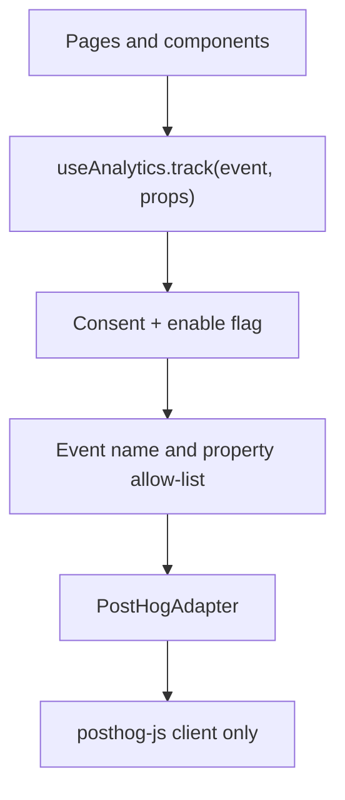
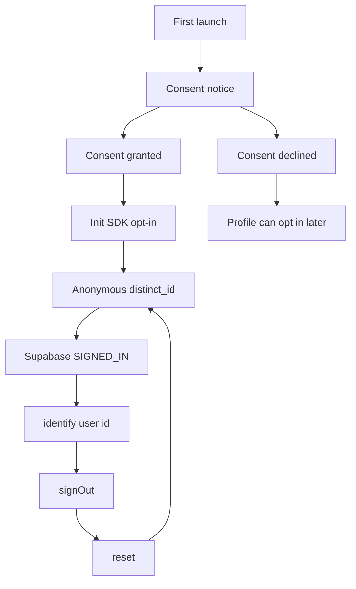

# Marikina Pilot Analytics

Product analytics plan for the Marikina launch. This document is the implementation plan only: do not add the SDK or fire events from this file.

**Pilot questions**

1. Do people find a suitable café quickly?
2. Do they trust the data and act on it?
3. Do they come back (week-1 and week-4 retention)?
4. Do deals and café detail pages drive real actions?

**In scope:** a hosted, consent-gated tracker on the free tier; a typed client wrapper; ~15 events; identity/reset; confidence_bucket; PostHog dashboards for staff; tests; a kill switch.

**Out of scope:** a custom `product_events` table; in-app admin or café-owner dashboards; session recording; heatmaps; autocapture; A/B tests; native iOS/Android PostHog SDKs; duplicating sign-ups, reviews, favorites, submissions, or claims that already live in Supabase.

**Hard rules:** no events before consent. Never send SSIDs, review text, café notes, emails, exact coordinates, or free-text search queries. Event names are `snake_case` and live in one file. Property values are enums or numbers.

Checked vendor docs on **2026-10-02**.

---

## Current-state summary

There is **no analytics SDK**. `package.json` has no PostHog, Umami, Mixpanel, or GA. The Amenity Source of Truth plan already noted this ([`docs/plans/amenity-source-of-truth.md`](amenity-source-of-truth.md) §a / §j).

| Concern | Path |
|---|---|
| Nuxt config / public runtime | [`nuxt.config.ts`](../../nuxt.config.ts) — `runtimeConfig.public` is only `mapTiles` and `r2PublicBaseUrl` |
| Env template | [`.env.example`](../../.env.example) |
| Only plugin | [`app/plugins/auth-storage.client.ts`](../../app/plugins/auth-storage.client.ts) — client-only, Capacitor session restore |
| Composables | [`app/composables/`](../../app/composables/) — `export function useX()`, auto-imported |
| Tests | Bun unit tests next to pure helpers, e.g. [`app/utils/amenity-status.test.ts`](../../app/utils/amenity-status.test.ts). No Vue component tests |
| Capacitor | [`capacitor.config.ts`](../../capacitor.config.ts), plugins `@capacitor/geolocation` and `@capacitor/preferences` only. No `@capacitor/app` |
| Ionic shell | [`app/app.vue`](../../app/app.vue) — `IonApp` + `IonRouterOutlet` (pages stay cached) |
| Auth | [`app/composables/useAuth.ts`](../../app/composables/useAuth.ts) |
| Privacy / terms | **None.** No `/privacy`, `/terms`, or consent UI |
| UTM / referral | **None.** Query params in use: `q`, `redirect`, audit `shop` / `corrects` |
| Deals product | **None.** Home has ad campaigns and promoted/partner placements that open a café |

Web is `nuxt build` (SSR cookies unless `NUXT_PUBLIC_AUTH_STORAGE=local`). Mobile is `nuxt generate` + Capacitor `dist` (`package.json` `build:mobile`). There is no `server/` tree; all data is fetched in the browser/WebView.

---

## a) Tool recommendation and trade-offs

**Recommend: PostHog Cloud EU** (`https://eu.i.posthog.com`). One project, staff-only dashboard. Do not embed charts in `/admin` or café-owner screens for the pilot.

| | PostHog Cloud (Pay-as-you-go, free usage) | Umami Cloud Hobby |
|---|---|---|
| Free events | **1,000,000 / month** | 100,000 / month |
| Projects / sites | 1 project | 1 website |
| Retention | 1 year | 6 months |
| Funnels / retention / cohorts | Yes (product analytics) | Yes (Insights v2.3+ / v2.5+ / v3.0+) |
| Official JS / Nuxt | `posthog-js`; Nuxt 3.7+ / 4 docs (`@posthog/nuxt` or a `.client` plugin) | Script + `window.umami`; SPA pageviews |
| Capacitor iOS/Android | Same WebView as Nuxt. Official native iOS/Android/RN SDKs exist if we ever leave the WebView | No official Capacitor/RN SDK in Umami docs. Community `react-native-umami-sdk` is unofficial |
| Regions | **US** Virginia (`us.i.posthog.com`); **EU** Frankfurt (`eu.i.posthog.com`). **No Asia region** | Cloud servers in US and EU; no documented per-project Asia region |
| Offline | In-memory batch + `sendBeacon` on unload. **Not a durable disk queue** | HTTP send; no documented client offline queue |
| Privacy defaults we need | `opt_out_capturing_by_default`, `autocapture: false`, disable replay/surveys/flags/experiments; project **Discard client IP**; disable GeoIP transformation | Cookie-less by default, but weaker product analytics for this pilot |
| Cost after free | ~$0.00005 / extra event; set a billing limit of $0 | Pro $20/mo for 1M events |

Sources checked **2026-10-02**:

- [PostHog pricing](https://posthog.com/pricing)
- [Product Analytics pricing](https://posthog.com/docs/product-analytics/pricing)
- [Nuxt.js (v4 / v3.7+)](https://posthog.com/docs/libraries/nuxt-js)
- [JavaScript web config](https://posthog.com/docs/libraries/js/config)
- [Persistence](https://posthog.com/docs/libraries/js/persistence)
- [IP / GeoIP privacy](https://posthog.com/docs/privacy/data-collection)
- [GDPR / EU hosting](https://posthog.com/docs/privacy/gdpr-compliance)
- [Umami Cloud pricing](https://umami.is/pricing)
- [Umami Cloud FAQ](https://docs.umami.is/docs/cloud/faq)
- [Umami Funnel / Retention / Cohorts](https://docs.umami.is/docs/insights)

**Why PostHog, not Umami.** The four questions need funnels, week-1 / week-4 retention, and breakdowns by `acquisition_source` and `confidence_bucket`. Both tools can draw those charts, but PostHog’s free 1M events, one-year retention, official Nuxt plugin pattern, and a single JS SDK inside Capacitor WebViews fit this repo. Umami’s 100K Hobby cap is easy to blow with card impressions + detail views, and mobile support is undocumented.

**Why not native PostHog iOS/Android SDKs.** Over-engineering. The shells already load the generated Nuxt app in a WebView (`webDir: 'dist'`). One `posthog-js` client covers web, iOS, and Android.

**Why not a Supabase events table.** Instructed out of scope. Staff already get funnels/retention in the hosted tool.

**Free-tier survival.** A Marikina pilot with ~15 manual events, no autocapture, no pageviews, and throttled card views should stay well under 1M/month. Set the PostHog billing limit to **$0** so overage cannot bill. If the meter approaches the cap, turn `NUXT_PUBLIC_ANALYTICS_ENABLED=false` (see §j).

---

## b) Architecture

One typed wrapper. The rest of the app never imports `posthog-js`. Swapping vendors later means replacing the adapter, not the call sites.



### Files to add (follow existing folders)

| File | Role |
|---|---|
| [`app/utils/analytics.ts`](../../app/utils/analytics.ts) | Event names, property enums, common props, `confidenceBucket()`, query scrubber, acquisition normalizer, card-view throttle. Pure TS, unit-tested |
| [`app/utils/analytics.test.ts`](../../app/utils/analytics.test.ts) | Consent gating helpers, scrubbing, throttle, bucket derivation |
| [`app/composables/useAnalytics.ts`](../../app/composables/useAnalytics.ts) | `track`, `identifyUser`, `resetUser`, `setConsent`, `hasConsent`. No-ops when disabled, declined, or SSR |
| [`app/plugins/analytics.client.ts`](../../app/plugins/analytics.client.ts) | Client-only init after consent. Pattern matches [`auth-storage.client.ts`](../../app/plugins/auth-storage.client.ts) (`defineNuxtPlugin`, `.client.ts` suffix) |
| [`app/utils/analytics-consent.ts`](../../app/utils/analytics-consent.ts) | Preferences + localStorage, same dual-write as [`app/utils/onboarding.ts`](../../app/utils/onboarding.ts) |
| [`app/components/analytics/AnalyticsConsentNotice.vue`](../../app/components/analytics/AnalyticsConsentNotice.vue) | First-launch notice |
| [`app/pages/privacy.vue`](../../app/pages/privacy.vue) | Public privacy page (does not exist today) |

Do **not** add `@posthog/nuxt`. That module autocaptures, pulls flags, and inits on the server. A hand-rolled client plugin is the smaller, safer match for this repo (one plugin, `redirect: false` already on Supabase, no Nitro routes).

### Runtime config

Add to [`nuxt.config.ts`](../../nuxt.config.ts) `runtimeConfig.public` and [`.env.example`](../../.env.example):

```ts
analytics: {
  enabled: process.env.NUXT_PUBLIC_ANALYTICS_ENABLED === 'true',
  key: process.env.NUXT_PUBLIC_POSTHOG_KEY || '',
  host: process.env.NUXT_PUBLIC_POSTHOG_HOST || 'https://eu.i.posthog.com',
  appVersion: process.env.NUXT_PUBLIC_APP_VERSION || '1.0.0',
}
```

Kill switch: `NUXT_PUBLIC_ANALYTICS_ENABLED=false` (or unset) → plugin returns without `posthog.init`. Missing key also no-ops. Rebuild/redeploy for web; `bun run cap:sync` for shells.

### Wrapper contract

```ts
track<E extends AnalyticsEventName>(
  event: E,
  props: AnalyticsEventProps[E],
): void
```

Before send:

1. `import.meta.client` and `enabled` and consent === `'granted'`.
2. Merge common properties (see below).
3. Drop unknown keys. Coerce enums. Reject if a forbidden key appears (`query`, `email`, `lat`, `lng`, `ssid`, `notes`, `review_text`).
4. Adapter `capture(event, props)`.

SDK init options (PostHog JS, 2026-10-02 docs):

- `opt_out_capturing_by_default: true`, then `opt_in_capturing()` only after grant
- `autocapture: false`
- `capture_pageview: false` / `capture_pageleave: false`
- `disable_session_recording: true`
- `disable_surveys: true`
- `advanced_disable_feature_flags: true` (also keeps experiments/surveys off)
- `person_profiles: 'identified_only'`
- `persistence: 'localStorage'` (Capacitor WebView has no useful first-party cookie across app restarts; do not use `localStorage+cookie`)
- `before_send`: drop `$ip`, `$geoip_*`, `$set`, `$set_once` with PII, and any event not in the catalog
- Do not load the replay / heatmap / surveys bundles

Do not use PostHog feature flags as the product kill switch. Env var is enough and avoids a `/flags` request.

### Common properties (every event)

| Property | Type | Source |
|---|---|---|
| `app_version` | `string` (semver from env) | `runtimeConfig.public.analytics.appVersion` |
| `platform` | `'web' \| 'ios' \| 'android'` | `Capacitor.getPlatform()`, map `web` for browser |
| `auth_state` | `'guest' \| 'signed_in'` | `useSupabaseUser()` / session |
| `acquisition_source` | `AcquisitionSource` | First-open capture, persisted (see §e) |

Register these as PostHog super properties after init so they cannot be omitted by a call site.

### Swapping tools later

Keep `AnalyticsAdapter` with `init`, `capture`, `identify`, `reset`, `optIn`, `optOut`. PostHog is the only implementation. A future Umami/Plausible adapter would implement the same interface; event names stay ours.

---

## Step 1 map — where each surface lives

### Plugins, config, env

- Plugins: only [`app/plugins/auth-storage.client.ts`](../../app/plugins/auth-storage.client.ts). Client suffix + `defineNuxtPlugin({ name, enforce: 'post' })`.
- Config: [`nuxt.config.ts`](../../nuxt.config.ts). Supabase module uses `NUXT_PUBLIC_SUPABASE_*`. Public runtime: tiles + R2.
- Mobile generate sets `NUXT_PUBLIC_AUTH_STORAGE=local` ([`package.json`](../../package.json) `build:mobile`).
- Amenity flag `NUXT_PUBLIC_AMENITY_SOURCE_OF_TRUTH` is **commented in `.env.example` and not wired** in `nuxt.config.ts`. Fetch already tries `shop_amenity_resolutions_public` and falls back on error ([`app/utils/approved-shops.ts`](../../app/utils/approved-shops.ts) `fetchAmenityResolutions`).

### Capacitor / native

- [`capacitor.config.ts`](../../capacitor.config.ts): `appId: 'com.kapedoko.fe'`, UA `KapeDoko/1.0`.
- Geolocation: [`app/composables/useDeviceLocation.ts`](../../app/composables/useDeviceLocation.ts).
- Preferences: [`app/utils/onboarding.ts`](../../app/utils/onboarding.ts).
- Android location perms in `AndroidManifest.xml`; iOS `NSLocationWhenInUseUsageDescription` in `Info.plist`.

### Router / Ionic cache

- Tabs: [`app/components/navigation/AppTabBar.vue`](../../app/components/navigation/AppTabBar.vue) — `ionRouter.navigate(path, 'root', 'replace')`.
- Cached pages re-enter via `onIonViewWillEnter` (Home, Search, cafe detail, review, profile, map). `onMounted` alone is not enough.
- Search and cafe ids sometimes read `window.location` because Ionic desyncs Vue `route`.
- Maps are `.client.vue` + `<ClientOnly>`.

### Auth identify / reset hooks

- `signIn` / `signOut` in [`useAuth.ts`](../../app/composables/useAuth.ts).
- Native `onAuthStateChange` already in the auth-storage plugin — attach `identify` / `reset` next to it.
- [`app/pages/app/profile.vue`](../../app/pages/app/profile.vue) `onSignOut` then `/app`.

### Feature surfaces (firing map is in §c)

| Surface | Path |
|---|---|
| Cold start / splash | [`app/app.vue`](../../app/app.vue) |
| Onboarding | [`app/pages/app/onboarding.vue`](../../app/pages/app/onboarding.vue), [`app/utils/onboarding.ts`](../../app/utils/onboarding.ts), [`app/middleware/onboarding.global.ts`](../../app/middleware/onboarding.global.ts) |
| Home search + filters + ads + cards | [`app/pages/app/index.vue`](../../app/pages/app/index.vue) |
| Search page | [`app/pages/app/search.vue`](../../app/pages/app/search.vue) |
| Filters | [`app/utils/cafe-filters.ts`](../../app/utils/cafe-filters.ts) |
| Query match | [`app/utils/cafe-search.ts`](../../app/utils/cafe-search.ts) — name **or** address substring. No area taxonomy |
| Cards | [`app/components/cafe/CafeCard.vue`](../../app/components/cafe/CafeCard.vue) — Home, Search, Favorites, [`NearbyCafesSheet.vue`](../../app/components/map/NearbyCafesSheet.vue) |
| Detail page | [`app/pages/app/cafes/[id]/index.vue`](../../app/pages/app/cafes/%5Bid%5D/index.vue) |
| Detail body / actions | [`app/components/cafe/CafeDetailContent.vue`](../../app/components/cafe/CafeDetailContent.vue) |
| Map + sheet | [`app/pages/app/map.vue`](../../app/pages/app/map.vue), [`KapeMap.client.vue`](../../app/components/map/KapeMap.client.vue), [`CafeDetailSheet.vue`](../../app/components/map/CafeDetailSheet.vue) |
| Location | [`useDeviceLocation.ts`](../../app/composables/useDeviceLocation.ts) — Home/Search/Map `onMounted` auto-prompt; map banner + profile preview retry |
| Favorites | [`useFavorites.ts`](../../app/composables/useFavorites.ts) — **guests save locally**; auth banner only on [`favorites.vue`](../../app/pages/app/favorites.vue) |
| Review | [`review.vue`](../../app/pages/app/cafes/%5Bid%5D/review.vue), [`useCafeReview.ts`](../../app/composables/useCafeReview.ts) |
| Ads | [`useActiveAds.ts`](../../app/composables/useActiveAds.ts), Home rail in `index.vue` |
| Promoted pins | [`shop_marker_tiers`](../../db/20260909_shop_placements.sql), [`marker-tier.ts`](../../app/utils/marker-tier.ts) |
| Amenity mapping | [`shop-mapper.ts`](../../app/utils/shop-mapper.ts), [`amenity-status.ts`](../../app/utils/amenity-status.ts) |
| Audit form (staff) | [`app/pages/admin/audits/new.vue`](../../app/pages/admin/audits/new.vue) — **exists**, not a pilot consumer event |
| Profile | [`app/pages/app/profile.vue`](../../app/pages/app/profile.vue) — consent goes after the Near You radius block |

---

## c) Final event catalog

Fourteen pilot events plus one phase-2 design stub. Every row maps to a pilot question. Names live in `ANALYTICS_EVENTS` in [`app/utils/analytics.ts`](../../app/utils/analytics.ts).

Challenges to the starting spec are in **Notes**.

| Name | Q | Trigger | Properties (plus common) | File | Phase |
|---|---|---|---|---|---|
| `app_opened` | 3 | After consent, once per cold start; native resume after ≥30 min background | `entry: 'cold' \| 'resume'` | [`app.vue`](../../app/app.vue); `@capacitor/app` `appStateChange` (new, shells only) | pilot |
| `onboarding_completed` | 1 | Step 3 “Let’s go!” | `step_reached: 3` | [`onboarding.vue`](../../app/pages/app/onboarding.vue) `finish` from `OnboardingStep3` `@complete` | pilot |
| `onboarding_skipped` | 1 | Skip control | `step_reached: 1 \| 2 \| 3` (`activeStep + 1`) | [`onboarding.vue`](../../app/pages/app/onboarding.vue) Skip `@click` — **split from `finish()`** so skip ≠ complete | pilot |
| `search_performed` | 1 | Search submit on Search page, including arrival from Home `?q=` | `query_type: 'name' \| 'area'`, `result_count: number`, `zero_results: boolean`, `area_name?: KnownArea` | [`search.vue`](../../app/pages/app/search.vue) `submitSearch` / `syncFromRoute`. **Not** Home `submitSearch` (that only navigates). **Not** map typeahead (debounce would duplicate; map submit that opens a café is a detail view) | pilot |
| `filter_applied` | 1 | Amenity/sort chip change after catalog is `ready` | `filter_name: CafeFilterId`, `result_count: number`, `confidence_bucket: ConfidenceBucket` | [`index.vue`](../../app/pages/app/index.vue) `setFilter`; [`search.vue`](../../app/pages/app/search.vue) chip `@click`. Skip the default `'near'` on first paint | pilot |
| `cafe_card_viewed` | 1 | ≥50% visible for 750 ms; once per `cafe_id` + `surface` per analytics session | `cafe_id`, `surface: 'home' \| 'search' \| 'map' \| 'favorites'`, `confidence_bucket` | Observer in [`CafeCard.vue`](../../app/components/cafe/CafeCard.vue) | pilot |
| `cafe_detail_viewed` | 2, 4 | Detail page `status === 'ready'` or map sheet `didPresent`; once per `cafe_id` per session | `cafe_id`, `wifi_confidence: ConfidenceBucket`, `outlet_confidence: ConfidenceBucket`, `source: 'feed' \| 'map' \| 'search' \| 'favorites' \| 'promotion'` | [`cafes/[id]/index.vue`](../../app/pages/app/cafes/%5Bid%5D/index.vue); [`CafeDetailSheet.vue`](../../app/components/map/CafeDetailSheet.vue) `@didPresent`. `source` from referrer tab / `?from=` / promotion click | pilot |
| `cafe_action` | 2, 4 | Navigate, call, or photo tap on detail | `cafe_id`, `type: 'navigate' \| 'call' \| 'photo_view'`, `confidence_bucket` | [`CafeDetailContent.vue`](../../app/components/cafe/CafeDetailContent.vue) — add `@click` on the existing `<a href>` (do not break `tel:` / Maps). Photo: `selectPhoto` | pilot |
| `map_opened` | 1 | Map tab `onIonViewWillEnter`, once per analytics session (not every tab re-entry) | _(common only)_ | [`map.vue`](../../app/pages/app/map.vue) | pilot |
| `location_permission` | 1 | Terminal result of `requestLocation` | `result: 'granted' \| 'denied' \| 'fallback_used'` | [`useDeviceLocation.ts`](../../app/composables/useDeviceLocation.ts) — `granted` if GPS used; `denied` if permission no; `fallback_used` if Metro Manila fallback (`usingFallback`) including `unavailable` | pilot |
| `auth_prompt_shown` | 2 | In-app sign-in CTA actually rendered or `goToLogin` from a gated action | `trigger: 'review' \| 'submit' \| 'report' \| 'claim' \| 'favorites_sync'` | Review unsigned body; submit-cafe `ensureSignedIn`; `CafeDetailContent.reportTarget`; claim CTA; favorites guest banner. **Not** middleware hard-redirects (those skip UI) | pilot |
| `review_started` | 2 | Review form ready (`status === 'ready' && allowed`), once per `cafe_id` per session | `cafe_id` | [`review.vue`](../../app/pages/app/cafes/%5Bid%5D/review.vue) | pilot |
| `promotion_viewed` | 4 | Home rail card ≥50% visible 750 ms, once per `promotion_id` per session | `promotion_id`, `cafe_id`, `promotion_kind: 'ad' \| 'promoted' \| 'partner'`, `placement: 'home_rail'` | [`index.vue`](../../app/pages/app/index.vue) `homeAds` | pilot |
| `promotion_clicked` | 4 | Home rail click (before `openCafe`) | `promotion_id`, `cafe_id`, `promotion_kind`, `placement: 'home_rail'` | [`index.vue`](../../app/pages/app/index.vue) `@click="openCafe(ad.shopId)"` | pilot |
| `deal_redeemed` | 4 | Counter code or QR confirm | `deal_id`, `cafe_id` | **Does not exist.** Needs a redemption flow | later |

`ConfidenceBucket` = `'team_verified' \| 'community_confirmed' \| 'reported' \| 'mixed' \| 'unknown'` — never rename this property.

`KnownArea` (only if the normalized query **equals** an allow-listed token, or contains it as a whole word; otherwise omit `area_name` and set `query_type: 'name'`). Never send the raw query. If two tokens match, use the longest:

`marikina`, `barangka`, `calumpang`, `concepcion_uno`, `concepcion_dos`, `fortune`, `industrial_valley`, `jesus_de_la_pena`, `malanday`, `marikina_heights`, `nangka`, `parang`, `san_roque`, `santa_elena`, `santo_nino`, `tanong`, `tumana`, `pasig`, `quezon_city`, `cainta`, `san_mateo`.

`filter_name` reuses `CafeFilterId` from [`cafe-filters.ts`](../../app/utils/cafe-filters.ts). `confidence_bucket` on `filter_applied` is the **modal** bucket among the filtered cafés; ties → `'mixed'`.

### Dropped or deferred (do not add)

| Idea | Why |
|---|---|
| `review_submitted` | Reviews already in Supabase. Funnel uses `auth_prompt_shown` → `review_started` → DB count |
| `cafe_action` `favorite` / `share` | Favorites are in DB (and work for guests). **No share UI** |
| `amenity_audit_completed` | Staff-only at [`admin/audits/new.vue`](../../app/pages/admin/audits/new.vue). Answers none of the four consumer questions. `admin_audit_log` already records `audit.create` |
| Autocapture `$pageview` | Duplicates Ionic cached visits; not needed if we fire `app_opened` / detail / map ourselves |
| Map typeahead `search_performed` | 180 ms debounce would spam. Map pick → `cafe_detail_viewed` `source: 'map'` |
| Tab-switch events | Over-engineering |
| In-app owner impression reports | Later; needs per-café aggregation and RLS, not raw PostHog access |

### Spec challenges

1. **`deal_viewed` / `deal_clicked`.** There is no deals product. Home renders `active_ad_campaigns` (badge “Ad”) or falls back to `markerTier` promoted/partner (badges “Sponsored” / “Partner”). Clicks only `navigateTo(/app/cafes/:id)`. Use `promotion_*` with `promotion_kind`. Keep `deal_redeemed` as phase 2.
2. **`auth_prompt_shown` trigger `favorite`.** Card/detail hearts do not prompt. Guests write localStorage. Prompt is the Favorites **sync** banner. Use `favorites_sync`, plus `report` and `claim` which do prompt.
3. **`onboarding_completed` vs skipped.** Both call the same `finish()` today. Split the handlers.
4. **`cafe_action` share / photo upload.** Share does not exist. Visitor photo upload does not exist. `photo_view` is gallery select only.
5. **Exact coordinates.** Navigate uses a Maps URL with lat/lng in the href. Track the **click**, never the URL or coordinates.

---

## d) Identity and consent



### Consent storage

Key `kapedoko-analytics-consent` = `'granted' | 'declined'`. Unset = not asked.

Write Capacitor Preferences first, then `localStorage`, same pattern as [`onboarding.ts`](../../app/utils/onboarding.ts). Read Preferences, migrate legacy localStorage.

Show [`AnalyticsConsentNotice.vue`](../../app/components/analytics/AnalyticsConsentNotice.vue) from [`app.vue`](../../app/app.vue) after the splash (or on top of it) when the key is unset. **No `posthog.init`, no anonymous id, no event queue, no acquisition persistence** until `granted`.

Profile ([`profile.vue`](../../app/pages/app/profile.vue), new panel **after** the Near You radius block, visible to guests and members):

- Status: “Usage analytics is on/off”
- Toggle or two buttons: Allow / Stop
- Link to `/privacy`

### Declined

- Do not init the SDK.
- Do not create or persist a PostHog distinct id.
- Do not persist `acquisition_source`.
- App works as today.
- Switching to Allow later starts a **new** anonymous id (no backfill of the declined period).
- Switching to Stop calls `opt_out_capturing()`, `reset()`, and clears analytics keys in Preferences/localStorage except the consent flag itself (`declined`).

### Identity

| State | Distinct id | `identify()` |
|---|---|---|
| Guest + granted | SDK random id, persisted in localStorage | Never |
| Signed in + granted | Supabase `user.id` (UUID) | `identify(user.id)` with no email, name, or phone in `$set` |
| Sign out | New anonymous id | `reset()` then re-register super properties (platform, version, acquisition if still stored) |

Hook `identify` / `reset` in [`analytics.client.ts`](../../app/plugins/analytics.client.ts) on `supabase.auth.onAuthStateChange`, next to the existing native session writer. Do not identify on guest.

Retention for guests is **pseudonymous**: the same device/browser can show up as the same anonymous person across days while consent and localStorage last. That is required for Q3. It is not a government ID and it is not linked to email until sign-in.

### Re-identification (honest limit)

Analytics **cannot be used by KapeDoko to look up a guest’s name, email, or exact map pin** from these events. That is not the same as “impossible to re-identify.” A determined party with the WebView, a tiny cohort, and extra data could still guess. Mitigations we will ship:

- No exact lat/lng, SSID, query string, review body, or email
- No device fingerprinting beyond PostHog’s default distinct id (no extra canvas/audio hash)
- Project setting **Discard client IP**; disable the GeoIP transformation so `$geoip_city_name` and related properties are not stored
- `person_profiles: 'identified_only'` so guests do not get rich person records
- No session replay / heatmaps / autocapture
- EU region; 1-year vendor retention then gone
- Consent off → no id at all

Do not claim “guests cannot be re-identified” in the privacy policy. Say we do not collect name, email, or precise location in analytics, and guests are stored under a random id on-device until they sign in.

---

## e) Capacitor specifics

| Topic | Decision |
|---|---|
| SDK | `posthog-js` inside the WebView for **web, iOS, and Android**. No `@posthog/react-native`, no native iOS/Android SDK |
| Init | Same `analytics.client.ts`. Capacitor WebView is a browser as far as the SDK is concerned |
| Persistence | `localStorage` for SDK state. Consent + acquisition use Preferences **and** localStorage so they survive WebView wipes better |
| `acquisition_source` | On first **granted** open, read `utm_source` / `utm_campaign` / `ref` **once**, map through `normalizeAcquisitionSource()`, persist. Never persist the raw query string. Later opens reuse the stored enum. Web and deep links share the same key |
| App lifecycle | Add `@capacitor/app` only for `appStateChange`. `isActive` after ≥30 min background → `app_opened` `{ entry: 'resume' }`. Cold start in `app.vue` after consent → `{ entry: 'cold' }` |
| Offline | PostHog JS batches in **memory** and flushes on an interval / `sendBeacon` unload. Killing the app while offline **drops** queued events. Do not build a custom disk queue (over-engineering). Navigate/call should use `{ transport: 'sendBeacon', send_instantly: true }` |
| Ad blockers | Web may lose events; iOS/Android WebViews generally do not. Dashboards will undercount web. Do not add a reverse proxy in the pilot |
| SSR | Plugin is `.client.ts`. `useAnalytics().track` is a no-op on the server. Mobile `nuxt generate` has no SSR at runtime |
| Ionic cache | Screen events (`map_opened`, `cafe_detail_viewed`, `review_started`) are session-deduped. Cards use IntersectionObserver + session key `cafe_id + surface`. Do not fire from `onMounted` alone on cached pages without the observer/dedupe |
| Android class | Existing `document.documentElement.classList.add('is-android')` is unrelated; leave it |

`AcquisitionSource` enum: `'organic' | 'direct' | 'referral' | 'instagram' | 'facebook' | 'tiktok' | 'google' | 'other'`. Unknown `utm_source` values collapse to `'other'`. Empty → `'direct'` on native, `'organic'` on web with a search referrer hostname we allow-list (`google.`, `bing.`, `duckduckgo.`), else `'direct'`. Never store the referrer URL.

---

## f) `confidence_bucket` derivation

Keep the property name through the Amenity Source of Truth rollout. Implementation: `confidenceBucketFromCafe(cafe)` and `confidenceBucketFromStatus(status)` in [`app/utils/analytics.ts`](../../app/utils/analytics.ts), reading the **already mapped** `CafeWorkFacts` (do not re-query SQL in the tracker).

### Resolver path (when `shop_amenity_resolutions_public` returned rows)

[`mapShopToCafe`](../../app/utils/shop-mapper.ts) already sets `wifiStatus` / `outletsStatus` / `longStayWifiStatus` from [`workFactsFromResolutions`](../../app/utils/amenity-status.ts).

Per amenity (`wifi_confidence`, `outlet_confidence`, and filter context):

1. If `availability === 'mixed'` → `'mixed'`
2. Else if `needsRecheck` → still the status `confidence` (`team_verified` when an audit is disputed). Do **not** invent a new enum value
3. Else use `status.confidence` (`team_verified | community_confirmed | reported | unknown`)

Café-level `confidence_bucket` (cards, `cafe_action`, modal filter bucket): conservative rank, **lower trust wins**:

`unknown` < `mixed` < `reported` < `community_confirmed` < `team_verified`

Use WiFi and outlets only (long-stay is a filter attribute, not the trust question).

`needs_recheck` does not rename the bucket; dashboards can still filter `team_verified` and, later, a dedicated property if we need it. **Do not add `needs_recheck` in the pilot** (stay near 15 events / small payloads). Stale team verification stays `team_verified` (matches filter trusted-positive).

### Legacy `shop_review_stats` path (view missing / fetch error)

[`workFactsFromStats`](../../app/utils/shop-mapper.ts): `< 3` total reviews → `UNKNOWN_WORK`. Else wifi/plug true if pct ≥ 50. [`statusesFromLegacyWork`](../../app/utils/amenity-status.ts) stamps those booleans as `community_confirmed` and never produces `team_verified` or `reported`.

Analytics overlay (do **not** trust that stamp for mixed):

| Condition | Bucket |
|---|---|
| `total_reviews < 3` or no stats | `unknown` |
| Decided amenity pct is exactly `50` (tie) | `mixed` |
| Else | `community_confirmed` |

Legacy cannot emit `team_verified` or `reported`. That is expected until the public resolution view is live.

Today the client **already prefers the view** when the select succeeds; the documented `amenitySourceOfTruth` env flag is **not** wired. When that flag is eventually added, `confidenceBucketFromCafe` stays the same: it reads `CafeAmenityStatus` already on the café. No event property rename. Optional debug-only `amenity_source: 'legacy' | 'resolver'` is over-engineering — skip it.

---

## g) Privacy review

Philippine Data Privacy Act (RA 10173): analytics is optional, consented, purpose-limited (product improvement for the Marikina pilot), minimized, and not used to sell ads.

### Property table

| Property | Why it is safe |
|---|---|
| `app_version` | Build identifier, not a person |
| `platform` | `web \| ios \| android` |
| `auth_state` | `guest \| signed_in` — not an email |
| `acquisition_source` | Closed enum, not the raw UTM string |
| `entry` | `cold \| resume` |
| `step_reached` | `1 \| 2 \| 3` |
| `query_type` | `name \| area` — **not** the typed string |
| `area_name` | Allow-listed barrio/city token only |
| `result_count` | Integer |
| `zero_results` | Boolean |
| `filter_name` | Existing chip id enum |
| `confidence_bucket` / `wifi_confidence` / `outlet_confidence` | Closed enum |
| `cafe_id` | Shop UUID already public in the catalog URL |
| `surface` / `source` / `placement` | Closed enums |
| `type` (`cafe_action`) | `navigate \| call \| photo_view` |
| `result` (`location_permission`) | `granted \| denied \| fallback_used` — **no coordinates, no accuracy** |
| `trigger` (`auth_prompt_shown`) | Closed enum |
| `promotion_id` | Campaign or placement café id |
| `promotion_kind` | `ad \| promoted \| partner` |
| Distinct id (guest) | Random, device-local, not an email |
| Distinct id (signed in) | Supabase user UUID. Needed to join pre/post login. Not displayed in-app |

### Never send

SSIDs, review text, submission notes, claim text, emails, display names, phone numbers, exact lat/lng, Maps URLs, `tel:` hrefs, free-text search, photo bytes, audit notes, IP, GeoIP city, device fingerprint extras, `$set` email.

### Consent copy (draft — legal review required)

**First-launch notice**

> Help us improve KapéDoko? We record taps like search, filters, and café opens so we can see whether Marikina cafés are easy to find. We do not record your email, your exact location, or what you type into search. You can change this later in Profile.

Buttons: **Allow analytics** / **Not now**

**Profile**

> Usage analytics: when this is on, KapéDoko sends anonymous product events to our analytics provider (PostHog, EU). We do not send your email, precise GPS, or search text. [Privacy policy]

**Privacy page sentences to add** (there is no policy yet; these are the analytics clauses, not a full policy):

1. We use PostHog, hosted in the European Union, to understand how the KapéDoko app is used during the Marikina pilot.
2. We only do this if you tap Allow on the first-launch notice or turn Usage analytics on in Profile.
3. Events include which screens you open, which filters you use, and whether you tap directions or call on a café page.
4. We do not send your email address, the text of reviews, café submission notes, Wi‑Fi network names, exact map coordinates, or the words you type into search.
5. If you are not signed in, events are stored under a random identifier on your device. After you sign in, that identifier is replaced with your account id so we can see whether signed-in KapéBeans return.
6. You can turn analytics off in Profile. We then stop sending events and forget the analytics identifier on this device.
7. Session recordings, heatmaps, and advertising profiles are not used.
8. Analytics data is kept on PostHog’s free-tier retention (currently one year) and is not sold.

Link `/privacy` from the notice, Profile, login, and register. Store-required iOS privacy nutrition labels should list optional product analytics, not precise location.

---

## h) Dashboards (PostHog, staff only)

Build in the **production** project after the web checklist is green. Duplicate in the **dev** project first. Not shown in `/admin` or to café-owners.

### 1. Activation funnel — Q1 + Q2

**Insight:** Funnel, 1-day window, ordered.

`app_opened` → `search_performed` OR `filter_applied` OR `map_opened` → `cafe_detail_viewed` → `cafe_action` where `type` is `navigate` or `call`.

**Read:** % of openers who reach a café and then leave the app toward the café. Break down by `platform` and `acquisition_source`.

### 2. Week-1 and week-4 retention by acquisition — Q3

**Insight:** Retention, event `app_opened`, first occurrence cohort.

- Week-1: users with `app_opened` on day 0 who have another `app_opened` on **days 7–13**.
- Week-4: same, **days 28–34**.

**Breakdown:** `acquisition_source`, then `platform`. Guest and signed-in persons both count (anonymous id or identified id).

### 3. Filter health — Q1

**Insight:** Trend, `filter_applied` where `filter_name` ∈ `wifi, plugs, long-stay, fast-wifi, reliable-outlets` and `result_count < 3`, divided by all such `filter_applied`.

**Read:** Share of amenity-filter uses that return fewer than 3 cafés. If this stays high, the catalog or the trusted-positive bar is too strict for Marikina.

### 4. Zero-result searches — Q1

**Insight:** `search_performed` where `zero_results = true`, as a % of all `search_performed`, split by `query_type`.

**Read:** Name vs area. Area tokens should be rare; a high `name` zero-rate means people look for shops we do not have.

### 5. Trust effect — Q2

**Insight:** Funnel or formula.

- Conversion A: `cafe_detail_viewed` → `cafe_action` `navigate` or `call`, breakdown `wifi_confidence` (and a twin for `outlet_confidence`).
- Conversion B: `cafe_card_viewed` → `cafe_detail_viewed` by `confidence_bucket`.

**Read:** Do `team_verified` cafés earn more detail opens and navigation taps than `unknown`? This is the most important product chart.

### 6. Promotions — Q4

**Insight:** Table.

- Unique `promotion_viewed` and `promotion_clicked` per `cafe_id` / `promotion_kind`.
- CTR = clicks / views.
- Secondary: `promotion_clicked` → `cafe_detail_viewed` `source: 'promotion'` → `cafe_action` navigate/call.

**Read:** Which partner cafés get taps, and whether a tap becomes directions.

---

## i) Test plan

Automated tests stay Bun tests of pure TS, like the rest of the repo. No Vue test runner.

### Unit (`app/utils/analytics.test.ts`)

| Case | Expect |
|---|---|
| Consent unset or declined | `shouldCapture()` false |
| Consent granted, flag off | false |
| Consent granted, flag on | true |
| Unknown event name | throw or drop (drop in production helper) |
| Extra keys `query`, `email`, `lat` | stripped |
| Search query “best wifi in San Roque!!” | `query_type: 'area'`, `area_name: 'san_roque'`, no raw string |
| Query “Kape Batik” | `query_type: 'name'`, no `area_name` |
| Acquisition `utm_source=Instagram` | `'instagram'` |
| Acquisition `utm_source=random-blog` | `'other'` |
| Card throttle same cafe+surface | second view ignored |
| Card throttle different surface | second view allowed |
| Legacy stats 2 reviews | `unknown` |
| Legacy stats 3 reviews, wifi 50% | `mixed` |
| Legacy stats 3 reviews, wifi 80% | `community_confirmed` |
| Resolver wifi `team_verified` + outlets `unknown` | café bucket `unknown` |
| Resolver availability `mixed` | `mixed` |
| `identify` only when session present | covered by a tiny composable helper if extracted; otherwise document as manual |

### Dev-project checklist (web)

Use a **separate** PostHog project. Never point local at production.

For each catalog event: grant consent, perform the trigger, confirm **one** event in Live, properties are enums/numbers, no `$geoip_*` / `$ip`, no query string.

Then: decline on a fresh profile → Live stays empty. Allow later → events start. Sign in → next event identified with the UUID. Sign out → subsequent events are a new anonymous id. Toggle off in Profile → stop.

### Device / emulator

iOS Simulator and Android emulator after `bun run cap:sync` with the **dev** key:

- Cold `app_opened`
- Background 31+ minutes (or temporarily lower the threshold in dev) → `resume`
- Kill app offline after a click → event may drop (document, do not fail the pilot)
- Location deny → `location_permission` `denied` or `fallback_used`, never coordinates
- Onboarding Skip vs Let’s go → two different events

### Duplicate-event check

| Risk | How to catch |
|---|---|
| Ionic `onIonViewWillEnter` on tab return | `map_opened` count = 1 per session while bouncing Home ↔ Map |
| Cafe detail page + map sheet both mounted | One `cafe_detail_viewed` per café per session |
| Home navigates to Search with `?q=` | One `search_performed`, not one on Home and one on Search |
| Card list virtualization | Scroll Home twice; each café at most one `cafe_card_viewed` |
| Ad rail fallback vs live ads | `promotion_id` stable; clicking does not also fire a ghost second promotion |

---

## j) Phased rollout

Each PR independently shippable. Hours are evening/weekend effort, not calendar time.

| PR | Hours | Ships | Rollback |
|---|---|---|---|
| 1. Typed core + env | 4–6 | `analytics.ts` + tests, runtime config, `.env.example`, client plugin that **never inits** unless enabled+granted, `useAnalytics` no-ops. No UI events | Unset `NUXT_PUBLIC_ANALYTICS_ENABLED` |
| 2. Consent + privacy | 6–8 | Notice, Profile toggle, `/privacy` draft, login/register links, consent storage | Hide notice; flag off |
| 3. Identity + open | 3–4 | `identify` / `reset`, `app_opened`, acquisition capture, `@capacitor/app` resume | Flag off |
| 4. Find (Q1) | 6–8 | Onboarding split, search, filter, map_opened, location_permission, card views | Flag off |
| 5. Trust + detail (Q2) | 5–7 | Detail viewed, cafe_action, auth_prompt_shown, review_started, confidence helper | Flag off |
| 6. Promotions (Q4) | 3–4 | promotion viewed/clicked on Home rail | Flag off |
| 7. Dashboards + QA | 4–6 | The six PostHog insights on the **dev** project, then production; duplicate-event pass on web + one device | Flag off; delete/disable insights |

Do not merge PR 4–6 with the production key until PR 2 is live (consent).

**Rollback (normative):** `NUXT_PUBLIC_ANALYTICS_ENABLED=false` stops all capture after rebuild. Rotate `NUXT_PUBLIC_POSTHOG_KEY` if the token leaked. PostHog project setting can pause capture without a deploy. Consent decline is the user-level stop.

---

## k) Pilot success thresholds

Fill the Target column before launch. Measure in PostHog on Marikina traffic, week 4 of the pilot, consented users only.

| Metric | Definition | Target | Actual |
|---|---|---|---|
| Week-4 retention | % of `app_opened` day-0 cohort with another `app_opened` on days 28–34 | _TBD_ | |
| Week-1 retention | Same, days 7–13 | _TBD_ | |
| Detail → action | % of `cafe_detail_viewed` with `cafe_action` `navigate` or `call` within 1 day | _TBD_ | |
| Trust gap | Detail→action rate for `team_verified` minus `unknown` | _TBD_ (expect verified ≥ unknown) | |
| Filter result rate | % of amenity `filter_applied` with `result_count >= 3` | _TBD_ | |
| Zero-result search | % of `search_performed` with `zero_results` | _TBD_ (lower is better) | |
| Promotion CTR | `promotion_clicked` / `promotion_viewed` | _TBD_ | |
| Time to first detail | Median minutes `app_opened` → first `cafe_detail_viewed` | _TBD_ | |

---

## l) Open questions and assumptions

### Assumptions (proceed)

1. Staff look at PostHog, not `/admin`. Café-owners do not see analytics in the pilot.
2. EU Cloud is acceptable (no PH or Asia region). IP discard + no GeoIP is enough location minimization.
3. Guest retention uses a persistent anonymous id **after consent**. That is pseudonymous, not anonymous-in-the-strict-sense.
4. Billing limit $0 on PostHog. Stay on the free 1M events.
5. `deal_redeemed` waits for a real redemption flow.
6. Home search only counts once the Search page runs. Map typeahead is not `search_performed`.
7. Default Home filter `'near'` does not fire `filter_applied` until the user changes the chip.
8. `cafe_id` UUIDs in analytics are acceptable because they are already in public URLs.
9. Adding `@capacitor/app` is in scope for resume `app_opened`; without it we would undercount Q3 on mobile.
10. Privacy page is new; there is no existing legal URL to patch.
11. Amenity flag remains opportunistic-view-fetch until someone wires `NUXT_PUBLIC_AMENITY_SOURCE_OF_TRUTH`; the bucket helper still reads `CafeWorkFacts`.
12. Distinct skip vs complete requires a small onboarding handler split (product change, not just a track call).

### Open questions (do not block the plan)

- Exact success numbers for §k (product, not engineering).
- Whether production and staging share one PostHog org with two projects (recommended) or two orgs.
- iOS App Store privacy questionnaire wording — use the draft sentences, have counsel review.
- Whether a Cloudflare reverse proxy for `eu.i.posthog.com` is worth it later for web ad blockers. Skip for launch.

### Explicitly deferred

Owner-facing ads reporting, session replay, heatmaps, flags, experiments, autocapture, native SDKs, durable offline queue, `product_events` table, `review_submitted`, favorite/share actions, staff `amenity_audit_completed`, in-app dashboards, Asia residency.

---

## Risks

| Risk | Mitigation |
|---|---|
| SSR calling `window` / PostHog | `.client.ts` plugin; `track` no-ops unless `import.meta.client` |
| Ionic page cache double-fires | Session dedupe + IntersectionObserver, not `onMounted` alone |
| Consent race (event before notice) | Queue nothing; init only after grant |
| Splash vs notice | Notice can sit on `LoadingScreen` / `app.vue`; still no init |
| Web ad blockers | Accept undercount; mobile WebView is the pilot truth |
| Offline drop | Document; `sendBeacon` on navigate/call |
| `cafe_id` + time + coarse city as quasi-id | No GeoIP, no GPS, IP discarded |
| Promotion fallback rail using café id as `promotion_id` | `promotion_kind` distinguishes `ad` vs `promoted` vs `partner` |
| Legacy vs resolver bucket shift | Same property; expect more `reported` / `team_verified` after SoT SQL is applied — that is a real product change, not a rename |
